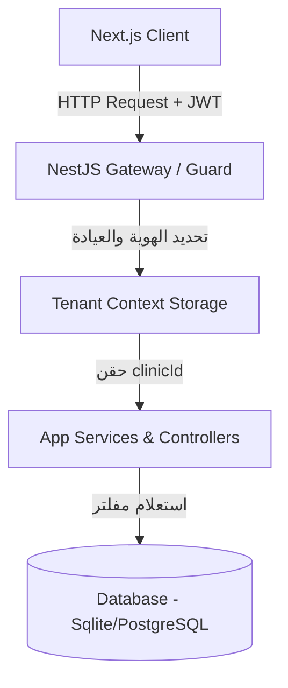
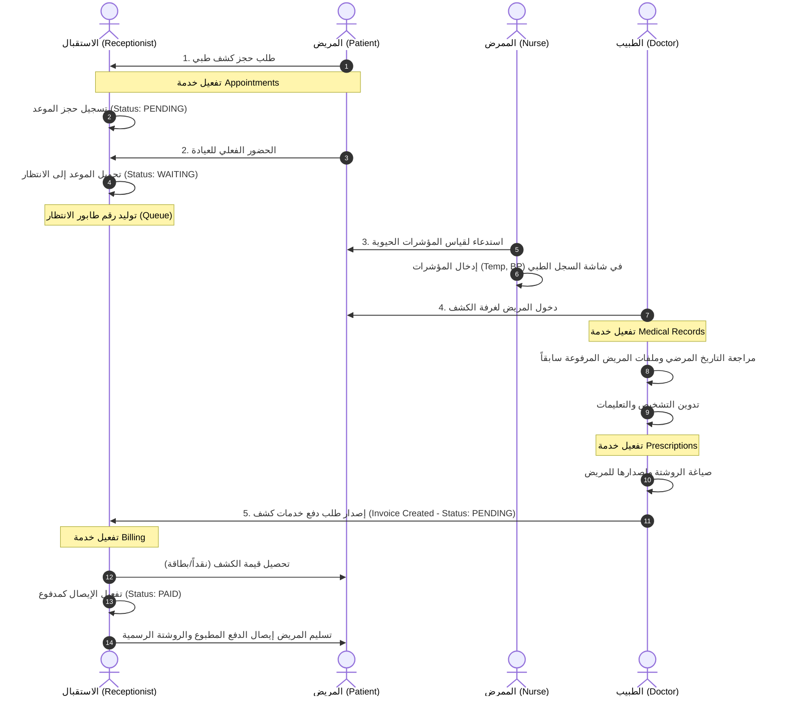

# الدليل التقني والهندسي الشامل لخدمات وموديولات نظام ClinicPro

يقدم هذا الدليل توثيقاً هندسياً وفنياً مفصلاً لـ **كل الخدمات والوحدات التشغيلية (Services & Modules)** المكونة لنظام **ClinicPro** في الواجهتين الخلفية (NestJS) والأمامية (Next.js)، مع شرح كامل للمسارات، الأهداف، وبنية البيانات التابعة لكل خدمة.

---

## 1. المعمارية العامة وميكانيكية فصل البيانات (Multi-Tenancy)

يعمل النظام بآلية **تعدد المستأجرين (Multi-Tenancy)** باستخدام قاعدة بيانات مشتركة مفصولة منطقياً:
*   يتم حقن معرف العيادة `clinicId` في الـ Context الخاص بكل طلب عن طريق `tenantStorage` (باستخدام NestJS Scoped Execution Context).
*   تلقائياً، تقوم الـ Middleware الخاصة بـ `PrismaService` بفلترة الاستعلامات للموديلات التي تملك حقل `clinicId` مباشرة، وتُسمى هذه الموديلات بـ `tenantModels`.



### آلية عزل الموديلات وتجنب أخطاء الاستعلام (Query Validation)
1. **الموديلات المعزولة مباشرة (`tenantModels`):**
   تضم الموديلات التي تحتوي في قاعدة البيانات على الحقل `clinicId` بشكل مباشر مثل: `ClinicSettings`, `User`, `Doctor`, `Appointment`, `MedicalRecord`, `Prescription`, `Invoice`, `FileUpload`, `AuditLog`, `ClinicPatient`, `MedicationStock`, `DoctorMedicine`.
2. **الموديلات المعزولة بالعلاقة (Relation-Based Isolation):**
   هناك موديلات لا تحتوي على الحقل `clinicId` مباشرة وإنما تتبع لموديل آخر معزول (مثل `StockMovement` التابع لـ `MedicationStock`، أو `DoctorAvailability` و `DoctorTimeOff` التابعين لـ `Doctor`). 
   * **تنبيه هام للمطورين:** يجب **عدم** إضافة هذه الموديلات في مصفوفة `tenantModels` في الـ `PrismaService` لتفادي أخطاء الاستعلامات `Unknown arg clinicId` التي تؤدي إلى خطأ 500 (Internal Server Error). يتم عزل هذه الموديلات تلقائياً عبر عزل الموديل الأب (مثل فلترة حركات المخزون عبر جلب المخزون التابع للعيادة أولاً).

---

## 2. دليل الخدمات والموديولات التفصيلي (System Services Reference)

---

### 1. خدمة إدارة العيادات والفروع (`Clinics Module`)
*   **الهدف:** تهيئة بيانات العيادة الأساسية وفروعها وتفعيل الاشتراكات.
*   **المسارات الأساسية (Endpoints):**
    *   `GET /clinics/my-clinic` - استرجاع بيانات العيادة الحالية (الاسم، العنوان، اللوجو، الفرع الرئيسي).
    *   `PUT /clinics/my-clinic` - تحديث الهوية البصرية وبيانات الاتصال الخاصة بالعيادة.
    *   `POST /clinics` - إنشاء عيادة جديدة بالكامل (لصلاحية `PLATFORM_OWNER` فقط).
*   **نموذج البيانات الأساسي (JSON Response):**
    ```json
    {
      "id": 2,
      "name": "عيادات الشفاء التخصصية",
      "phone": "+20100200300",
      "subscriptionPlan": "PREMIUM",
      "subscriptionStatus": "ACTIVE"
    }
    ```

---

### 2. خدمة الهوية وإدارة المستخدمين (`Auth & Users Module`)
*   **الهدف:** التحقق من الهوية، توليد توكن الولوج (JWT)، وإدارة حسابات الموظفين بالعيادة وتخصيص أدوارهم.
*   **المسارات الأساسية:**
    *   `POST /auth/login` - تسجيل دخول المستخدم وإصدار التوكن.
    *   `GET /users/me` - استرجاع بيانات المستخدم النشط حالياً وجلسة عمله.
    *   `POST /users` - إضافة مستخدم جديد للعيادة (طبيب، ممرض، استقبال).
    *   `PUT /users/:id` - تعديل صلاحيات المستخدم أو بياناته الحسابية.
*   **الأدوار المعتمدة بالنظام:**
    *   `PLATFORM_OWNER`: مدير النظام بالكامل.
    *   `CLINIC_ADMIN` (أو `ADMIN`): مدير العيادة وصاحب كامل الصلاحيات الإدارية والمالية.
    *   `DOCTOR`: الطبيب المعالج (صلاحية الكشوفات الطبية والروشتات).
    *   `NURSE`: الممرض (متابعة الطابور، حجز المواعيد، وقياس العلامات الحيوية).
    *   `RECEPTIONIST`: موظف الاستقبال (إصدار الإيصالات وتحصيل الماليات والمواعيد).

---

### 3. خدمة الأطباء وقائمة المواعيد المتاحة (`Doctors Module`)
*   **الهدف:** إدارة بيانات الأطباء التابعين للعيادة، وضبط مواعيد عملهم، وجدول الحضور اليومي والغياب لتهيئة حجز المواعيد.
*   **المسارات الأساسية:**
    *   `GET /doctors` - قائمة الأطباء في العيادة وتخصصاتهم الطبية.
    *   `POST /doctors` - تسجيل طبيب جديد وتحديد سعر الكشف الأساسي له (`consultationFee`).
    *   `GET /doctors/:id/slots?date=YYYY-MM-DD` - استخراج فترات الحجز المتاحة للطبيب بالتحديد في يوم معين بناءً على جدول عمله.
    *   `POST /doctors/time-off` - تسجيل إجازة أو فترة غياب لطبيب لمنع الحجوزات بها.

---

### 4. خدمة إدارة المرضى (`Patients Module`)
*   **الهدف:** الاحتفاظ بسجلات المرضى والتحقق من هوياتهم وعرض ملفهم الموحد.
*   **المسارات الأساسية:**
    *   `GET /patients` - قائمة البحث السريع في المرضى بفلترة الاسم أو رقم الهاتف.
    *   `POST /patients` - تسجيل مريض جديد بالنظام والتحقق من عدم تكراره.
    *   `GET /patients/:id` - استدعاء الملف المالي والسريري الكامل للمريض.
    *   `PUT /patients/:id` - تحديث بيانات الاتصال، الطوارئ، فصيلة الدم، أو الحساسيات.
*   **نموذج الاستجابة لملف المريض (Response Pattern):**
    ```json
    {
      "id": 12,
      "firstName": "محمد",
      "lastName": "أحمد",
      "phone": "01099887766",
      "bloodGroup": "O+",
      "allergies": "البنسلين",
      "medicalHistory": "ضغط دم مرتفع مزمن"
    }
    ```

---

### 5. خدمة حجز المواعيد وطابور الانتظار (`Appointments & Queue Module`)
*   **الهدف:** حجز كشوفات المرضى وإدارة وصولهم الفعلي وترتيب دخولهم للطبيب بالدقيقة.
*   **المسارات الأساسية:**
    *   `POST /appointments` - حجز موعد جديد لمريض مع طبيب في تاريخ محدد.
    *   `PUT /appointments/:id/status` - تغيير حالة الموعد (`PENDING` -> `WAITING` -> `EXAMINING` -> `COMPLETED`).
    *   `GET /appointments/queue?doctorId=:id` - استعراض طابور الانتظار اللحظي والنشط لطبيب محدد اليوم مرتباً بالوصول.
*   **آلية طابور الانتظار (Queue Mechanism):**
    1.  عند حضور المريض للعيادة، يقوم الموظف بتحديث حالته إلى `WAITING`.
    2.  يمنح النظام المريض رقماً تسلسلياً تلقائياً (`queuePosition`) استناداً لترتيب الوصول الفعلي وتخزينه في Redis لضمان السرعة.
    3.  شاشة الطبيب والتمريض تُحدث تلقائياً لعرض من عليه الدور حالياً.

---

### 6. خدمة الكشوفات والتشخيص الطبي (`Medical Records Module`)
*   **الهدف:** توثيق الفحص الطبي الفعلي والتشخيص والعلامات الحيوية لكل مريض.
*   **المسارات الأساسية:**
    *   `POST /medical-records` - تسجيل تشخيص زيارة حالية وعلاماتها الحيوية.
    *   `GET /medical-records/patient/:patientId` - أرشيف الكشوفات التاريخية بالكامل للمريض لتمكين الطبيب من تتبع تطور حالته.
    *   `GET /medical-records/:id` - تفاصيل كشف طبي محدد.
*   **بنية السجل الطبي (JSON Structure):**
    ```json
    {
      "chiefComplaint": "صداع مستمر وزغللة في العين",
      "diagnosis": "ارتفاع مفاجئ في ضغط الدم الإسنادي",
      "treatmentPlan": "راحة تامة لمدة يومين مع دواء خافض للضغط"،
      "vitalSigns": {
        "bloodPressure": "150/95",
        "pulse": 88,
        "temperature": 37.1
      }
    }
    ```

---

### 7. خدمة الروشتات والتعليمات (`Prescriptions Module`)
*   **الهدف:** صياغة ووصف الأدوية والجرعات للمريض وطباعتها بشكل منظم.
*   **المسارات الأساسية:**
    *   `POST /prescriptions` - إنشاء روشتة جديدة مصاحبة للزيارة.
    *   `GET /prescriptions/:id` - تفاصيل الروشتة وعناصرها بغرض الطباعة أو الصرف.
*   **نموذج بنية الروشتة (Response Example):**
    ```json
    {
      "id": 89,
      "prescribedDate": "2026-05-29",
      "instructions": "تكرار الفحص بعد أسبوعين",
      "items": [
        { "medicineName": "Panadol 500mg", "dosage": "قرص كل 8 ساعات", "duration": "5 أيام" },
        { "medicineName": "Amoxicillin 1g", "dosage": "قرص بعد الأكل مرتين يومياً", "duration": "7 أيام" }
      ]
    }
    ```

---

### 8. خدمة دليل ودستور الأدوية للعيادة (`Medications Module`)
*   **الهدف:** توفير قاعدة بيانات بالأسماء العلمية والتجارية للأدوية وطرق استخدامها المقترحة لتسهيل عملية الاختيار للطبيب وتجنب الأخطاء الإملائية.
*   **المسارات الأساسية:**
    *   `GET /medications` - دليل البحث في قائمة الأدوية المسجلة محلياً أو عالمياً.
    *   `POST /medications` - تسجيل دواء جديد بالكامل في دليل العيادة الخاص.
    *   `GET /my-medicines` - الأدوية الأكثر استخداماً وتفضيلاً لدى الطبيب المعالج للوصول الأسرع.

---

### 9. خدمة الماليات والتحصيل المبسط (`Billing Module`)
*   **الهدف:** تسيير التحصيل المالي عبر إصدار إيصالات دفع مبسطة للخدمات المقدمة وتوثيق حالاتها.
*   **المسارات الأساسية:**
    *   `POST /billing` - إنشاء إيصال جديد بالخدمات المحددة وأسعارها والخصم المقر.
    *   `PUT /billing/:id` - تحصيل قيمة الإيصال نقداً أو بفيزا/بطاقة وتغيير حالته إلى `PAID`.
    *   `DELETE /billing/:id` - إلغاء الإيصال (تغيير حالته إلى `CANCELLED` لحفظ الأثر المالي دون مسحه تماماً).
*   **شكل طلب إنشاء إيصال (Request payload):**
    ```json
    {
      "patientId": 12,
      "items": [
        { "description": "جلسة علاج طبيعي للظهر", "price": 250 },
        { "description": "مستلزمات علاجية وضِماد", "price": 50 }
      ],
      "discount": 30,
      "notes": "خصم نقدي مباشر"
    }
    ```

---

### 10. خدمة المخزون ونواقص المستلزمات (`Inventory Module`)
*   **الهدف:** متابعة مخزون المستلزمات الطبية (مثل القفازات، الضمادات، السرنجات) والتحكم في حركتي الوارد والصادر وتنبيه الإدارة بالنواقص.
*   **المسارات الأساسية:**
    *   `GET /inventory` - جلب حالة المخزون الحالية وتحديد المواد التي أوشكت على النفاد.
    *   `POST /inventory/movement` - تسجيل عملية صرف مستلزمات لكشف معين أو توريد شحنة جديدة للعيادة.
    *   `GET /inventory/alerts` - جلب الإشعارات النشطة للنواقص لإرسالها لـ `CLINIC_ADMIN`.

---

### 11. خدمة مركز الملفات والأشعات (`Uploads & Files Module`)
*   **الهدف:** تمكين الكادر الطبي من رفع وحفظ المستندات الطبية، نتائج تحاليل المعامل، وصور الأشعة التابعة لملف المريض.
*   **المسارات الأساسية:**
    *   `POST /uploads` - رفع ملف جديد وحفظه في السيرفر أو السحابة واستخراج رابط فريد له.
    *   `GET /uploads/patient/:patientId` - جلب كامل المستندات المرفوعة للمريض مع اسم من قام برفع الملف والتوقيت.
    *   `DELETE /uploads/:id` - إزالة ملف من قائمة المريض.

---

### 12. خدمة التنبيهات والتذكيرات الذكية (`Notifications & Reminders`)
*   **الهدف:** التذكير بالمواعيد وتنبيه الموظفين بمهام العيادة اليومية.
*   **المسارات الأساسية:**
    *   `GET /notifications` - قائمة التنبيهات الخاصة بالمستخدم الحالي.
    *   `PUT /notifications/:id/read` - وضع علامة مقروء على التنبيه لإنهاء عرضه.
    *   `POST /reminders/send-sms` - تفعيل إرسال رسائل تذكير تلقائية للمرضى بمواعيد كشوفاتهم القادمة.

---

### 13. خدمة لوحة الإحصائيات والأداء والتقارير (`Dashboard Module`)
*   **الهدف:** تجميع بيانات الكشوفات، الماليات، وحالة الحجوزات لاستخلاص الرؤى التشغيلية والمالية.
*   **المسارات الأساسية:**
    *   `GET /dashboard/stats` - الأرقام السريعة لليوم الحالي (الإيرادات، عدد الكشوفات النشطة، النواقص بالمخزن).
    *   `GET /dashboard/charts?range=30days` - إحصائيات تدفق الإيرادات وحجم الزيارات الطبية مقسمة يومياً أو أسبوعياً.

---

### 14. خدمة بوابة المريض الإلكترونية (`Patient Portal Module`)
*   **الهدف:** بوابة إلكترونية مخصصة للمريض للاطلاع على مواعيده السابقة والقادمة، روشتاته الطبية الموصوفة له، وتحميل ملفاته الطبية دون القدرة على تعديل أي منها.
*   **المسارات الأساسية:**
    *   `GET /patient-portal/my-appointments` - مواعيد المريض الشخصية.
    *   `GET /patient-portal/my-prescriptions` - الروشتات الصادرة للمريض من أطباء العيادة.

---

## 3. ميكانيكية دورة حياة الكشف المكتملة (End-to-End Workflow)

يوضح المخطط التالي تدفق البيانات وتكامل كافة الخدمات الطبية والمالية معاً عند زيارة المريض:



---

## 4. شروط ومحددات المطورين للتطوير على الخدمات

1.  **سلامة العمليات المالية (Transaction Safety):**
    *   عند إنشاء إيصال مالي (`Invoice`)، يجب التحقق من وجود الخدمات في قائمة أسعار العيادة.
    *   ممنوع مسح الإيصالات تماماً من قاعدة البيانات؛ فقط يُسمح بتعديل حالتها إلى `CANCELLED` لمنع التلاعب بالسجلات الحسابية للعيادة.
2.  **استقلالية الخدمات (Service Decoupling):**
    *   يتم الربط بين موديول الكشف والماليات عبر معرف الموعد `appointmentId` ومعرف المريض `patientId` فقط، ولا يتم تضمين أي حقول طبية حساسة كالتشخيص أو تفاصيل الروشتة في الإيصال المالي لحماية خصوصية المريض الطبية.
3.  **دقة التوقيت والمناطق الزمنية:**
    *   تسجل قاعدة البيانات كل الأوقات بصيغة `UTC` العالمية وتخزين التواريخ كـ ISO Strings، وتقوم الواجهة الأمامية بالتحويل للمنطقة الزمنية للعيادة (المخزنة في `ClinicSettings` مثل `Africa/Cairo`) لضمان عدم حدوث تضارب في مواعيد الأطباء.

---
*تم إصدار وتحديث هذا المستند الفني الشامل في: 29 مايو 2026*
*بواسطة: فريق هندسة النظم وتطوير البرمجيات - ClinicPro*
